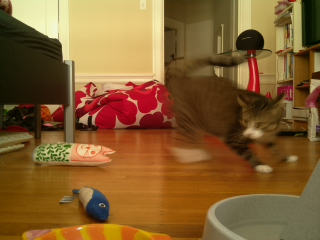

# Raspberry Pi KittyCam

**Updated: Tutorial is now available on my blog, [KittyCam - Building a Raspberry Pi Camera with Cat Face Detection in Node.js](http://www.girliemac.com/blog/2015/12/25/kittycam-raspberrypi-camera-cat-face-recog-nodejs/), also 
[Upgrading KittyCam with Raspberry Pi 3](http://www.girliemac.com/blog/2016/06/13/kittycam-update-with-raspberrypi3/)
**

---

[](https://www.youtube.com/watch?v=wqewhjhjaHY)

[Watch the demo on YouTube :-)](https://www.youtube.com/watch?v=wqewhjhjaHY)


Raspberry Pi app using a camera and PIR motion sensor, written in Node.js using Johnny-Five and KittyDar for  with cat facial detection.

**I will write up the step-by-step tutorial (hopefully) soon!** But until then, here is the instruction how to run this code locally with your own Raspberry Pi.


## Building the Circuit

### What you need

- Raspberry Pi 2 (with Raspbian. Also with WiFi adapter)
- 5MP Camera Board Module ([buy](http://amzn.to/1pg7Y91))
- Pyroelectric Infrared (PIR) motion sensor ([buy](http://amzn.to/1pg828D))
- 3 F/F wires ([buy](http://amzn.to/1Mf50Xy))

If you are a Raspberry Pi newbie, I recommend to buy this [CanaKit Raspberry Pi 2 Complete Starter Kit](http://amzn.to/1QNFlcB).

### Wiring

#### Camera to Pi
- Connect the camera module to the CSI port

#### PIR Sensor to Pi
- 1 red wire: PIR-VCC to Pi's 5V
- 1 black wire: PIR-GND to Pi's ground
- 1 whatever color wire: PIR-OUT to Pi's Pin 7 (GPIO 4)


## Software Setup

### 1. Install node.js in your Raspberry Pi

#### Make sure your Pi is up-to-date

`$ sudo apt-get update`

then

```
$ sudo apt-get upgrade
```

#### [Updated] Download Node

Node for ARM is now supported officially on Nodejs.org! Download and install from there:

```bash
$ wget https://nodejs.org/dist/v4.4.5/node-v4.4.5-linux-armv7l.tar.xz
$ tar -xvf node-v4.4.5-linux-armv7l.tar.xz 
$ cd node-v4.4.5-linux-armv7l
$ sudo cp -R * /usr/local/
```

Check if node is successfully installed:

```
$ node -v
```

### 2. Enable Camera access

Go to Pi Software Config Tool to enable camera

```
$ sudo raspi-config
```

Test if your camera is working by try typing this command on terminal:

```
$ raspistill -o photo.jpg
```


## Running this Code

I would like to say, `$ npm install` to install all the dependencies, and voilà! but it is **not**!

### 1. Prerequisite: Install Cairo to the System

for cat facial detection, I am using **kittydar**, which dependencies including **node-canvas**, which requires **Cairo**.

So let's get Cairo on your Raspbian first.

```
$ sudo apt-get install libcairo2-dev libjpeg8-dev libpango1.0-dev libgif-dev build-essential g++
```

See more info on how to install Cairo for Node [Canvas](https://github.com/Automattic/node-canvas), see this [*Installation Ubuntu and other Debian based systems*](https://github.com/Automattic/node-canvas/wiki/Installation---Ubuntu-and-other-Debian-based-systems)

If you download and use the whole `node_modules` contents of this repo, skip the step 2, and proceed to step 3.
Otherwise, go to the next step to fresh-install the next several modules.


### 2. Install Dependency Modules

#### Install KittyDar


*This is an actual photo taken by my Raspberry Pi, while Jamie was eating, and detected by KittyDar cat facial detection!*


Once your environment is set up, in this RPi-KittyCam dir, install node dependency modules.

Ideally install from `npm install kittydar —save`

However, node-canvas 1.0.1 (the version specified in package.json for KittyDar) failed to build with the current Node.js (v0.12.6).

So what I did was download the zip from github repo into *node_modules*, alter the `package.json`, where canvas: `~1.0.1` to `^1.0.1` so that the latest v1.x canvas will be installed as I `npm install` from the kittydar directory.

Get the zip from [my forked repo](https://github.com/girliemac/kittydar).

*Note: I am sending a pull request (https://github.com/harthur/kittydar/pull/27)*

The following packages are specified in`package.json` file so they will be installed from `npm install` automatically, however, I just list them in case you want to know what they are:

#### Install Johnny-Five

[Johnny-Five](https://jonny-five.io) is a Javascript robotics framework that let you program micro controllers easily with carious hardware APIs.

```
$ npm install johnny-five
```

#### Install Raspi-io

This I/O plugin allows you to use Johnny-Five on Raspbian. 

```
$ npm install raspi-io
```

#### Install PubNub

This is used to establish real-time live-updating the web interface, use PubNub (v3.x, imcompatible with the new v4).

```
$ npm install pubnub@3.15.2
```

You need to [sign up and get you own publish and subscribe keys!](http://pubnub.com)

#### Install Cloudinary

To store photos in a cloud, I am using Cloudinary.

```
$ npm install cloudinary
```

You need to [sign up and get you own API keys!](http://cloudinary.com)

### 3. Set up your config.js with Credentials

I removed my `config.js` file from the public repo so nobody abuses my API keys. So you need to create your own `config.js` in the root dir of the app. 

The file should include your API keys:

```
module.exports = {

  cloudinary: {
    cloud_name: 'your_name',
    api_key: 'your_API_key',
    api_secret: 'your_API_secret',
  },

  pubnub: {
    subscribe_key: 'your_sub_key',
    publish_key: 'your_pub_key'
  }

};
```

### 4. Run the Code

You must run with sudo, because some modules used in the app requires root access:

```
$ sudo node kittyCam.js
```

The camera will take a photo when a motion is detected by the PIR sensor.
Then the child_process runs to detect if there is any cats in the photo.
When there are any cat, it sends the photo to Cloudinary.

Analyzed photos are deleted from the filesystem to clear up Pi.

### 5. View the Live Photo Update on Web

- Get the web interface source code from `gh-pages` branch.
- Run the `index.html` on browser


## Known Issue

### Raspistill (Camera Software)
- Raspistill continuously takes a bunch of photos when I set `t = 0` (and crashes Pi while so many child process is running) so I have set `t = 1`, which causes delay. It seems to take only integer. Cats are too fast to wait for a second. 
- The camera can't capture recognizable pics after the sun is set. My room light is too dark.

### KittyDar (Cat Facial Detection)

- During mealtime. When a cat is eating food (head-down position), the facial detection doesn't detect the cat at all.
- When my cat moves, eats from the side of the dish, or put his butt on the camera, it fails to tell me my cat was eating.

#### The cat photos failed to be recognized





